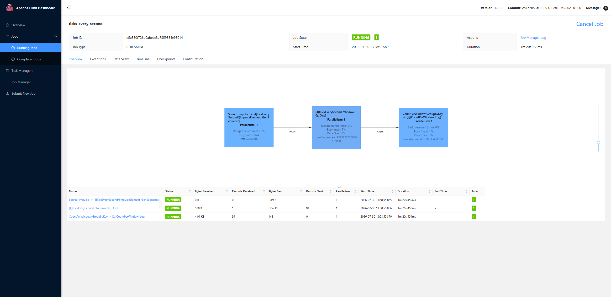
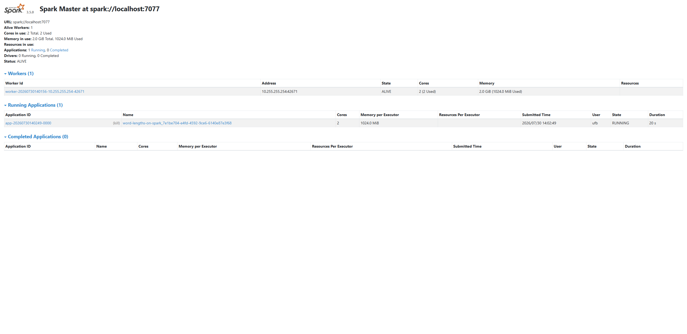
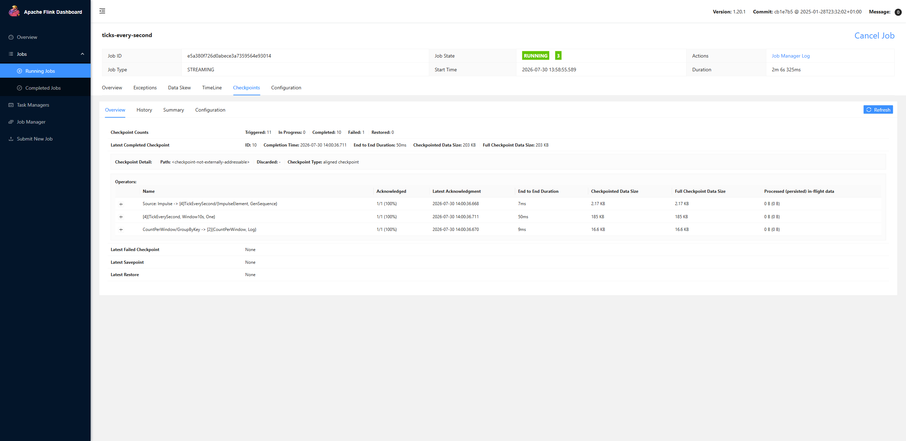

# GSoC 2026 Final Report: Native Streaming Transforms for the Apache Beam Python SDK

| | |
|---|---|
| **Contributor** | Elia Liu ([@Eliaaazzz](https://github.com/Eliaaazzz)) |
| **Organization** | [Apache Beam](https://beam.apache.org/) (Apache Software Foundation) |
| **Mentor** | Yi Hu ([@Abacn](https://github.com/Abacn)) |
| **Project** | Native Streaming Transforms for the Apache Beam Python SDK |
| **Period** | May to August 2026 |

This page is the final work product submission for my Google Summer of Code 2026
project. The work links to public pull requests, issues, and code on
[apache/beam](https://github.com/apache/beam); validation and benchmark figures
come from local runs whose method and caveats are recorded in
[§6 Validation and benchmarks](#6-validation-and-benchmarks).

---

## Summary

The Python SDK historically lacked the streaming building blocks that the Java
SDK has had for years: there was no way to write a custom unbounded (never
ending) source, and no `Watch` transform for repeatedly polling an input that
keeps growing. This project delivered both, validated each of them on four
runners, and fixed the runner bugs the work ran into.

- **First public `UnboundedSource` API for the Python SDK**
  ([#38724](https://github.com/apache/beam/pull/38724)), resolving
  [#19137](https://github.com/apache/beam/issues/19137), a long-standing gap
  between the Java and Python SDKs, first filed as BEAM-6119 back when Beam
  still used JIRA.
- **`Watch` transform for the Python SDK**
  ([#39023](https://github.com/apache/beam/pull/39023)) with a
  duplicate-suppression design that improves on the Java original. `Watch` has
  to remember what it has already emitted so it never emits it twice, and in
  Java that memory grows forever. An opt-in timestamp-cursor mode
  ([#39090](https://github.com/apache/beam/pull/39090)) lets it forget the
  bookkeeping for outputs it has long since moved past, so the memory stays
  bounded, addressing
  [#18459](https://github.com/apache/beam/issues/18459). A port of the cursor
  back to the Java SDK is in review
  ([#39746](https://github.com/apache/beam/pull/39746)).
- **`MatchContinuously` refactored onto `Watch`**
  ([#39461](https://github.com/apache/beam/pull/39461)), so Beam's
  continuous file matching gets the same opt-in `timestamp_cursor` mode and
  stops accumulating state for every file it has ever seen.
- **Cross-runner validation and runner fixes.** Running the new transforms on
  each runner Beam supports turned up bugs in three of them, all now fixed:
  saved checkpoint state that grew without bound on Flink
  ([#39191](https://github.com/apache/beam/pull/39191), fixing
  [#27648](https://github.com/apache/beam/issues/27648)); a source that pauses
  and resumes itself leaving the steps downstream of it unscheduled in Prism
  ([#39572](https://github.com/apache/beam/pull/39572), fixing
  [#39446](https://github.com/apache/beam/issues/39446)); and Spark batch not
  supporting reads that pause and resume at all
  ([#39331](https://github.com/apache/beam/pull/39331), part of
  [#19468](https://github.com/apache/beam/issues/19468)).
- **14 project pull requests merged into apache/beam**
  (+6,621 / −612 lines), 5 more in review, plus documentation, a contributor
  guide, and benchmarks of both new transforms
  ([§6.3](#63-unboundedsource-throughput-and-checkpoint-cadence),
  [§6.4](#64-watch-deduplication-state-measured)).

---

## 1. Project goals

From the proposal:

1. Design and implement a public **`UnboundedSource` API** for the Python SDK,
   built as a wrapper that runs the source as a *splittable DoFn* (SDF). An
   SDF is Beam's built-in way to express a read that can pause, resume, and be
   split across workers. The wrapper adds progress checkpointing, event-time
   watermarks, and a hook for acknowledging data once the runner has durably
   stored it.
2. Port the **`Watch`** transform from Java to Python. `Watch` calls a
   user-supplied poll function over and over to pick up new items as an input
   grows, stops on a termination condition, and emits each item exactly once.
   Address the known Java scalability issue
   [#18459](https://github.com/apache/beam/issues/18459) in the port.
3. **Validate on real runners** (Dataflow, Flink, Spark, Prism, DirectRunner),
   beyond unit tests, and fix what turns up.
4. Benchmark and document the result.

All four goals were met. Section 6.3 benchmarks the `UnboundedSource` wrapper
and section 6.4 the `Watch` transform, both on one machine; a distributed run
is future work ([§8 Remaining work](#8-remaining-work)).

## 2. What was delivered

The project ran as **two main threads**, the `UnboundedSource` API and the
`Watch` transform, plus the runner and infrastructure issues that came up
while validating them, which I fixed along the way.

### 2.1 Thread 1: `UnboundedSource` for Python ([#38724](https://github.com/apache/beam/pull/38724))

`apache_beam/io/unbounded_source.py` adds `UnboundedSource`, `UnboundedReader`,
and `CheckpointMark` (the same three classes a Java user writes today), plus a
wrapper that runs the source as an SDF. The wrapper works on any runner that can
execute a never-ending read of this kind and can tell the source when its data is safely
stored: the DirectRunner, Prism, Flink, and Dataflow. Spark cannot
yet do this ([#19468](https://github.com/apache/beam/issues/19468)).

A source author implements `start` / `advance` / `get_current` /
`get_watermark` / `get_checkpoint_mark` and nothing else. The SDK handles the
rest: tracking how far the read has got, pausing and resuming it, reporting the
watermark, and calling `CheckpointMark.finalize_checkpoint` only after the
runner has durably committed the data. That is the point at which a source
can safely acknowledge messages back to a queue.

Follow-ups merged during the project:

- [#38892](https://github.com/apache/beam/pull/38892) adds a test in Beam's
  cross-runner suite (`ValidatesRunner`) that exercises the wrapper on each
  runner in the matrix.
- Mentor review of the runtime behavior led to a cap on how much one call can
  emit, in records and in wall-clock time, after which the source pauses and
  hands control back. This mirrors Java's
  `OutputAndTimeBoundedSplittableProcessElementInvoker` and stops a fast source
  from occupying a worker indefinitely.


*A Python streaming pipeline on a real Flink 1.20 session cluster, a
production-style deployment with a coordinator and worker nodes that happens
to run on my machine. A never-ending source ticking once a second feeds a
windowed count, and each step reports its own live watermark.*

### 2.2 Thread 2: `Watch` for Python ([#39023](https://github.com/apache/beam/pull/39023))

`apache_beam/io/watch.py` adds `Watch`, `PollFn`, `PollResult`, and the
termination conditions `never()` / `after_total_of()`. For each input element,
the transform calls the user's poll function over and over, emits an output the
first time it sees that output's identity, saves its progress between poll
rounds, and stops when the poll declares itself complete or the termination
condition fires.

How that "have I seen this before?" memory is stored is where Python
deliberately departs from Java:

- **Java** keeps a fingerprint of every output it has ever emitted, forever, so
  a watch that runs for a long time accumulates state without limit
  ([#18459](https://github.com/apache/beam/issues/18459)).
- **Python** ([#39090](https://github.com/apache/beam/pull/39090)) adds an
  opt-in **`timestamp_cursor`** mode. It keeps only the latest event time it
  has emitted so far, where the event time is the timestamp the item carries
  from the source, and treats any output more
  than `allowed_lateness` older than that as already seen. Only the
  fingerprints near that moving frontier need to be kept, so the state stays
  small no matter how long the watch runs. This fits sources that hand out
  their items in roughly increasing time order; the default mode keeps Java's
  remember-everything behavior, which is correct even for sources that can
  produce a much older item at any moment. The cursor is a single timestamp and
  never stores the items themselves.
- The same cursor is being ported back to the Java `Watch` in
  [#39746](https://github.com/apache/beam/pull/39746), the Python port
  feeding an improvement back upstream to Java.

Also merged: support for modern type hints when Beam works out how to serialize
a `Watch` output ([#39547](https://github.com/apache/beam/pull/39547)), and the
[#39461](https://github.com/apache/beam/pull/39461) refactor that rebuilds
`fileio.MatchContinuously` on top of `Watch` (keeping the old implementation for
users who turn duplicate suppression off).

### 2.3 Related fixes: runner and infrastructure issues the two threads ran into

Running a never-ending read for hours at a time on each runner turned up real
bugs, some long known and some new. "Portable" below means the mode in which a
runner executes a pipeline written in a language it is not itself written in.
This is the mode every Python pipeline uses to reach Flink or Spark, and the
one where these bugs live.

| Runner | Bug | Fix |
|---|---|---|
| Flink (portable) | Every time a source paused and saved its place, the runner registered a **brand-new** piece of Flink state every time, so the set of registered state entries grew without limit and a long-running polling source eventually exhausted the heap ([#27648](https://github.com/apache/beam/issues/27648), open since 2023) | Keep all the paused work in one reused state entry, and delete each entry when its resume timer fires: [#39191](https://github.com/apache/beam/pull/39191), **merged** |
| Prism | When a source that pauses and resumes itself started out with no data, the steps reading from it were never scheduled, so the pipeline's clock never advanced and the job hung ([#39446](https://github.com/apache/beam/issues/39446)) | Schedule the consumers of such a source too: [#39572](https://github.com/apache/beam/pull/39572), **merged** |
| Spark (portable, batch) | The runner had nothing wired up to receive the unfinished remainder of a read, so any transform that paused itself failed the very first time it tried; several such tests were simply skipped for this runner (part of [#19468](https://github.com/apache/beam/issues/19468)) | Park the unfinished remainder under an in-memory timer and replay it once the stage has drained its input, the same approach portable Flink batch uses: [#39331](https://github.com/apache/beam/pull/39331), **merged**; streaming remains open |
| Spark (streaming) | A source that reported nothing new in a batch lost its watermark, and processing-time timers fired out of time order | [#39823](https://github.com/apache/beam/pull/39823), [#39825](https://github.com/apache/beam/pull/39825), **in review** |
| Infra (Windows) | The Gradle property that passes options to Beam's cross-runner tests lost its quotes on Windows, breaking every local run of that suite | [#39365](https://github.com/apache/beam/pull/39365), **merged**; a related fix that makes a failed file upload stop the job immediately ([#39367](https://github.com/apache/beam/pull/39367), for [#39364](https://github.com/apache/beam/issues/39364)) is in review |


*A word-length demo job from the Python SDK running on a real Spark 3.5
standalone cluster, a master at `spark://localhost:7077` with a registered
worker. This is the runner where
[#39331](https://github.com/apache/beam/pull/39331) taught batch mode to handle
a read that pauses and resumes.*

### 2.4 Documentation and benchmarks

- [#39529](https://github.com/apache/beam/pull/39529): `UnboundedSource`
  section in the Python I/O connector developer guide (the first public docs
  for the API).
- [#39580](https://github.com/apache/beam/pull/39580): contributor guide for
  running Python pipelines against a local Flink cluster (a setup used
  throughout this project's validation).
- [#39579](https://github.com/apache/beam/pull/39579): CHANGES.md entries for
  both new APIs; [#39212](https://github.com/apache/beam/pull/39212): Flink
  version-reference refresh on the runner page.
- Two benchmarks on the project's own transforms: the `UnboundedSource`
  wrapper's throughput and checkpoint cadence
  ([§6.3](#63-unboundedsource-throughput-and-checkpoint-cadence)), and the
  `Watch` deduplication state as the polled set grows
  ([§6.4](#64-watch-deduplication-state-measured)).

## 3. Merged pull requests

All work in this report falls in the GSoC period (May to August 2026). The
project's 14 merged PRs total +6,621 / −612 lines, all on the two threads and
the issues around them.

| PR | Area | Summary |
|---|---|---|
| [#38724](https://github.com/apache/beam/pull/38724) | Python | Add the `UnboundedSource` API and the wrapper that runs it (resolves [#19137](https://github.com/apache/beam/issues/19137)) |
| [#38892](https://github.com/apache/beam/pull/38892) | Python | Add an `UnboundedSource` test to Beam's cross-runner suite |
| [#39023](https://github.com/apache/beam/pull/39023) | Python | Add the `Watch` transform for polling an input that keeps growing |
| [#39090](https://github.com/apache/beam/pull/39090) | Python | Stop `Watch` state from growing forever, using a timestamp cursor |
| [#39547](https://github.com/apache/beam/pull/39547) | Python | Support modern type hints when inferring the `Watch` output serializer |
| [#39461](https://github.com/apache/beam/pull/39461) | Python | Rebuild `MatchContinuously` on top of the `Watch` transform |
| [#39191](https://github.com/apache/beam/pull/39191) | Flink | Stop the state saved by a paused read from growing without bound (fixes [#27648](https://github.com/apache/beam/issues/27648)) |
| [#39572](https://github.com/apache/beam/pull/39572) | Prism | Schedule the steps downstream of a source that pauses and resumes (fixes [#39446](https://github.com/apache/beam/issues/39446)) |
| [#39331](https://github.com/apache/beam/pull/39331) | Spark | Support reads that pause and resume, in batch mode |
| [#39365](https://github.com/apache/beam/pull/39365) | Infra | Fix test pipeline options losing their quotes on Windows, which broke the cross-runner suite |
| [#39529](https://github.com/apache/beam/pull/39529) | Docs | Document UnboundedSource in the Python I/O connector guide |
| [#39580](https://github.com/apache/beam/pull/39580) | Docs | Add a contributor guide for running Python on a local Flink cluster |
| [#39579](https://github.com/apache/beam/pull/39579) | Docs | Add CHANGES entries for Python UnboundedSource and Watch |
| [#39212](https://github.com/apache/beam/pull/39212) | Docs | Update Flink version references on the Flink runner page |

## 4. Open pull requests (in review)

| PR | Area | Summary |
|---|---|---|
| [#39746](https://github.com/apache/beam/pull/39746) | Java | Stop the Java `Watch` state from growing forever, porting the Python timestamp cursor back to Java ([#18459](https://github.com/apache/beam/issues/18459)) |
| [#39823](https://github.com/apache/beam/pull/39823) | Spark | Keep a source's last watermark when it reports nothing new in a batch |
| [#39825](https://github.com/apache/beam/pull/39825) | Spark | Fire processing-time timers in oldest-first order |
| [#39367](https://github.com/apache/beam/pull/39367) | Portability | Stop the job immediately when uploading one of its files fails ([#39364](https://github.com/apache/beam/issues/39364)) |
| [#39849](https://github.com/apache/beam/pull/39849) | Prism | Honor the delay a paused read asks to wait before it resumes (fixes [#39848](https://github.com/apache/beam/issues/39848), found during final validation) |

## 5. Design decisions and trade-offs

The interesting engineering was giving Python users **the same behavior Java
users already rely on**, while building it out of the mechanisms the Python SDK
actually has. The main decisions:

**Run the source as an SDF.** Java runners know how to execute an
`UnboundedSource` directly; the runners the Python SDK uses do not, and the
only thing they can execute is an SDF. So the wrapper expresses the reader as
one: the `advance()` loop lives inside the SDF's `process` method, pausing is
expressed by handing the unread remainder back to the runner
(`tracker.defer_remainder()`), and the reader's saved position travels with
that remainder. This is what lets the same source run unchanged on the
DirectRunner, Prism, Flink, and Dataflow; Spark still cannot run a never-ending
SDF ([#19468](https://github.com/apache/beam/issues/19468)).

**Watermarks.** A watermark is the source's promise that no record older than
this will arrive later, and Beam uses it to decide when a time window is
complete. The reader's `get_watermark()` is reported to the runner unchanged,
so Python keeps Java's contract, including the convention that returning
`MAX_TIMESTAMP` means "this source is finished for good" and lets a
never-ending read shut down.

**Finalizing a checkpoint is how a source acknowledges data.**
`finalize_checkpoint()` runs only after the runner has durably committed the
records that came before it. That is exactly the point at which a source may
tell the upstream system "you can drop these now", the same guarantee Java
gives its message-queue readers. Tests pin down the detail that matters:
the object handed to `finalize_checkpoint()` is the very one the reader
produced. Beam passes that instance through without copying it.

**Reader lifecycle.** Opening a fresh reader every time the runner hands over
a batch of work would make polling sources painfully slow, so readers are kept
in a cache between batches and evicted once idle. Resource use stays bounded
without reconnecting on every resume.

**A cap on how much one call may do.** The source stops after a set number of
records or a set amount of time and hands control back, mirroring Java's
`OutputAndTimeBoundedSplittableProcessElementInvoker`. Without this, a fast
source keeps reading inside a single call and never yields. The DirectRunner
hides the problem behind a one-second timer; the other runners do not.

**Splitting.** The source can be split when the pipeline starts
(`split(desired_num_splits)`), matching Java `UnboundedSource`, but a read
already in flight is never subdivided further. The docs say so explicitly.

**`Watch` is a single transform.** A single SDF owns the
whole per-input lifecycle: poll, check for duplicates, emit, wait until the
next round, terminate. Keeping all the per-input state in one place is what
made the cursor design possible in the first place.

**Duplicate suppression needs a stable fingerprint.** An output's identity is
the hash of its serialized form (the output itself by default, or whatever
`output_key_fn` returns). The serializer is switched to its deterministic
variant first, so two equal keys hash identically on different workers and
after a restart; if a type has no deterministic serializer, `Watch` refuses it
when the pipeline is built, so it never emits silent duplicates later.

**The timestamp cursor is opt-in.** By default `Watch` remembers a fingerprint
of every item it has seen, exactly like Java, which is correct for any source
whatsoever. `timestamp_cursor=True` trades that generality for bounded state:
it assumes items arrive in roughly increasing time order, treats anything more
than `allowed_lateness` older than the newest emitted item as already seen, and
discards the fingerprints that assumption has made redundant. A mentor-review
requirement shaped the stored format: the cursor is a single timestamp and
never holds items, so saved state cannot grow through the cursor itself.

**`MatchContinuously` stays compatible.** The refactor keeps the existing
constructor arguments and the old implementation for users who turn duplicate
suppression off. One behavior change is deliberate and called out in the PR:
with duplicate suppression on, the record of what has been seen is now saved
with the pipeline's checkpoints, so a pipeline restored from a checkpoint
remembers which files it already processed and does not reprocess them.

## 6. Validation and benchmarks

Sections 6.1 and 6.2 are the correctness evidence for the two APIs. Sections
6.3 and 6.4 benchmark them: the `UnboundedSource` wrapper's throughput and the
`Watch` transform's deduplication state.

### 6.1 Runner validation of the `UnboundedSource` wrapper (June 2026)

| Runner | Result |
|---|---|
| DirectRunner | 36 unit and end-to-end tests pass |
| Portable runners | the new cross-runner read test passes in all 6 runner configurations |
| Prism | passes, including the pause/resume, acknowledgment, and watermark tests |
| Flink 1.20 (workers run in the local Python process) | Beam's cross-runner Python suite: **174 passed, 52 skipped, 0 failed** (11 Windows and Docker-dependent tests deselected, documented in the run notes) |
| Dataflow (Runner v2, streaming) | **5/5** end-to-end tests, each run as a real streaming job and checked with `assert_that` |


*The checkpoint view of the streaming pipeline shown in section 2.1: ten
completed checkpoints, about 200 KB of state, and millisecond acknowledgments
per operator. The cluster is a standalone Flink session cluster, the setup the
contributor guide ([#39580](https://github.com/apache/beam/pull/39580))
documents.*

### 6.2 `Watch` validation across runners (June to August 2026)

| Runner | Result |
|---|---|
| DirectRunner | `watch_test.py` unit and end-to-end suite, merged and green with [#39023](https://github.com/apache/beam/pull/39023) / [#39090](https://github.com/apache/beam/pull/39090) |
| Flink 1.20 | `MatchContinuously`-on-`Watch` exercised end-to-end, including killing a worker node mid-run and restoring from a checkpoint ([#39461](https://github.com/apache/beam/pull/39461)) |
| Dataflow (Runner v2, streaming) | cursor mode and `MatchContinuously` exercised as real streaming jobs during the [#39090](https://github.com/apache/beam/pull/39090) / [#39461](https://github.com/apache/beam/pull/39461) work |
| Prism (built from master, 2026-08-22) | end-to-end `Watch` pipelines pass in both default and `timestamp_cursor` modes: files added mid-run were emitted exactly once and the run terminated on time. The same session found Prism ignoring the delay a paused read asks to wait for ([#39848](https://github.com/apache/beam/issues/39848)); with the fix ([#39849](https://github.com/apache/beam/pull/39849)) applied locally, the poll interval is honored and the `MatchContinuously` pipeline passes as well |

### 6.3 `UnboundedSource` throughput and checkpoint cadence

This measures the API this project delivered. A minimal in-memory source hands
the wrapper a one-million-record backlog, so the numbers show the wrapper's own
overhead, with no real connector's IO in the way. Throughput is over the drain
span (first record to last), so each runner's fixed startup is excluded.
DirectRunner and Prism run on one Windows machine; Flink 1.20 is a standalone
cluster under WSL2. Read them as a shape.

| Runner | Records per checkpoint (the cap) | Self-checkpoints | Throughput |
|---|---|---|---|
| Prism | 1,000 | 1,001 | ~34k rec/s |
| Prism | 10,000 | 101 | ~44k rec/s |
| Prism | 100,000 | 11 | ~44k rec/s |
| DirectRunner | 10,000 | 101 | ~41k rec/s |
| DirectRunner | 100,000 | 11 | ~44k rec/s |
| Flink 1.20 | 10,000 | 101 | ~150k rec/s |
| Flink 1.20 | 100,000 | 87 | ~136k rec/s |

Three things to read from this. First, the wrapper's per-record cost is small:
it drains a million records in seconds everywhere, tens of thousands a second
in-process and over a hundred thousand on Flink once warm. Flink also adds about
150 seconds of fixed cluster startup, which the drain-span figure leaves out, so
on wall-clock a short Flink job is dominated by it. Second, the cap added on
mentor review (section 2.1) sets how many records the source reads before it
saves its place and can resume: at 1,000 records it saves about a thousand times
over the drain, at 100,000 eleven times; on Flink the count also picks up
Flink's own checkpoint interval. Third, the same source ran unchanged on
DirectRunner, Prism, and Flink.

Spark is the exception: the wrapper does not run there. Portable Spark cannot run a
read that pauses and resumes ([#19468](https://github.com/apache/beam/issues/19468)),
the limit section 2.1 notes, and an attempt does not complete. Dataflow does run
it (validated in section 6.1); a Dataflow throughput run is future work
(section 8). The harness is
`benchmarks/unbounded_source/unbounded_source_benchmark.py`.

### 6.4 `Watch` deduplication state, measured

Section 6.3 measures a read path Beam already had. This one measures the
project's own work: the cost of `Watch`'s duplicate-suppression state as the
polled set grows, in the default remember-everything mode and in
`timestamp_cursor` mode. The poll re-lists a set that gains 2,000 items every
round for 100 rounds, so by the last round it hands `Watch` 200,000 items to
check. Each item keeps the event time of the round that created it, the way a
file keeps its modification time. Timings are wall-clock on one Windows
machine, so read them as a shape and not as a rate.

| Runner | Mode | Total wall time | Per-round work, first 10 rounds | Per-round work, last 10 rounds |
|---|---|---|---|---|
| DirectRunner | default | 111 s | 81 ms | 2,082 ms |
| DirectRunner | `timestamp_cursor` | 24 s | 40 ms | 437 ms |
| Prism | default | 59 s | 95 ms | 1,051 ms |
| Prism | `timestamp_cursor` | 15 s | 48 ms | 235 ms |

Both modes emit all 200,000 items exactly once. What differs is the state
behind them. In the default mode the per-round cost climbs steeply as the
remembered set grows, reaching one to two seconds a round by the end. With the
cursor on, the per-round cost stays far flatter and the whole run finishes
three to four times sooner, because the cursor lets `Watch` drop the
bookkeeping for items it has moved past. This is the
[#18459](https://github.com/apache/beam/issues/18459) scalability problem and
the [#39090](https://github.com/apache/beam/pull/39090) fix, shown on the
transform this project delivered. The harness is
`benchmarks/watch_state/watch_state_benchmark.py`.

## 7. Usage examples

Both APIs are merged and marked experimental. The examples below are taken from
the merged module docstrings.

### A custom unbounded source

```python
import apache_beam as beam
from apache_beam.io.unbounded_source import (
    CheckpointMark, UnboundedReader, UnboundedSource)

class MyCheckpointMark(CheckpointMark):
  def __init__(self, position):
    self.position = position

  def finalize_checkpoint(self):
    ...  # ack consumed messages up to `position` upstream

class MyReader(UnboundedReader):
  def start(self): ...           # position at the first record
  def advance(self): ...         # False = no data available right now
  def get_current(self): ...
  def get_current_timestamp(self): ...
  def get_watermark(self): ...   # MAX_TIMESTAMP = permanently finished
  def get_checkpoint_mark(self):
    return MyCheckpointMark(...)

class MySource(UnboundedSource):
  def split(self, desired_num_splits, options=None):
    return [self]
  def create_reader(self, options, checkpoint_mark):
    return MyReader(...)        # resume after checkpoint_mark if not None
  def get_checkpoint_mark_coder(self):
    return ...                  # how Beam serializes the checkpoint mark

with beam.Pipeline() as p:
  p | beam.io.Read(MySource()) | beam.Map(print)
```

### Watching an input for growth

```python
from apache_beam.io.watch import Watch, PollResult, after_total_of
from apache_beam.transforms.window import TimestampedValue
from apache_beam.utils.timestamp import Duration, Timestamp

def poll(prefix) -> PollResult[str]:
  now = Timestamp.now()
  outputs = [TimestampedValue(prefix + str(i), now) for i in range(3)]
  return PollResult.complete(outputs)

watched = inputs | Watch(
    poll,
    poll_interval=Duration(seconds=5),
    termination=after_total_of(60))
```

## 8. Remaining work

Three things are unfinished, and why:

1. **The benchmarks are single-machine.** Sections 6.3 and 6.4 run on one box,
   so they show shape and overhead; they do not state capacity. A distributed
   run (multi-node Flink against Dataflow) is future work.
2. **Spark still cannot run a never-ending read**
   ([#19468](https://github.com/apache/beam/issues/19468)). This project
   merged the batch half ([#39331](https://github.com/apache/beam/pull/39331)).
   Doing it in streaming means carrying an unfinished read across Spark's
   small-batch boundary (Spark streams by running a series of small batches), which reviewers and I agreed deserves a properly
   designed follow-up.
3. **Five PRs are in review** (see §4): the Java cursor port
   [#39746](https://github.com/apache/beam/pull/39746), the two Spark
   streaming fixes
   [#39823](https://github.com/apache/beam/pull/39823) /
   [#39825](https://github.com/apache/beam/pull/39825), the fail-fast file
   upload [#39367](https://github.com/apache/beam/pull/39367), and the
   Prism resume-delay fix
   [#39849](https://github.com/apache/beam/pull/39849) for
   [#39848](https://github.com/apache/beam/issues/39848), a bug found during
   the final week's validation. I will keep driving these after GSoC.

## 9. Blog posts

Longer-form writeups of the work, on my personal site:

- [Teaching Python pipelines to never stop](https://eliaaazzz.github.io/blog/beam-python-unbounded-sources/):
  the `UnboundedSource` API and the SDF wrapper behind it.
- [Watch: a polling transform for things that grow](https://eliaaazzz.github.io/blog/beam-python-watch-transform/):
  the `Watch` port and the timestamp-cursor design.
- [A local Flink cluster for Beam Python](https://eliaaazzz.github.io/blog/beam-python-local-flink/):
  the validation setup that became the contributor guide
  ([#39580](https://github.com/apache/beam/pull/39580)).
- [Beam Python on the Spark runner](https://eliaaazzz.github.io/blog/beam-python-spark-runner/):
  the portable Spark work around
  [#19468](https://github.com/apache/beam/issues/19468).

## 10. Acknowledgements

Thank you to my mentor **Yi Hu** for fast and rigorous reviews, and for
repeatedly pushing the project toward what users actually need. Three things
came directly out of those reviews: the limit on how much a source may read
before yielding, the rule that the cursor stores a timestamp and never the
items themselves, and the counting-source demos used to validate the whole
thing. Thanks also to the Beam
committers who reviewed the runner PRs, and to the Apache Beam community for
being a genuinely welcoming place to do streaming-systems work in the open.

I plan to keep contributing to Beam after GSoC: landing the open PRs above,
pushing [#19468](https://github.com/apache/beam/issues/19468) streaming
support forward, and helping the new APIs graduate from experimental.
